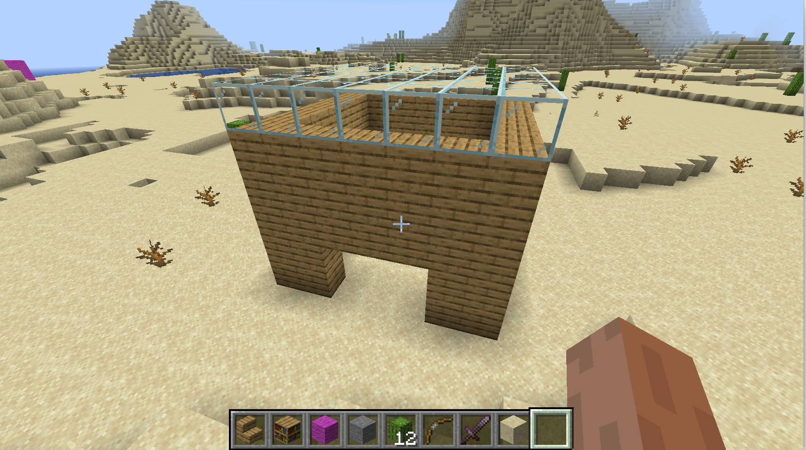

# minecraft-python-cursors

Gives you a nice little cursor abstraction to draw with.

# Overview

Once set up, you can use this library to programmatically draw blocks in Minecraft. Here is an example where you build a little hut around you.

```python
# Make a square cursor around you.
side = 7
c = cursor_here().square(side)

# Draw walls.
trace(c, height=5, block=wood_planks)

# A ceiling made of glass sounds nice.
fill(c.move(0,5,0), block=glass)

# Let's not forget an opening.
door = c.center().move(side/2,0,0).grow(0,2)

# Check the door is where we think it is.
blink(door)

# Yes it is, carve the door.
trace(door, block=air, height=3)
```




# Features

* No more guessing coordinates: use the "blink" feature to show in the world where you're about to draw.

* Built-in shapes to save time: lines, rectangles, circles, cubes, cylinders in one or two intuitive commands.

# Installation and getting started

Prerequisites:
 * Python
 * Java Minecraft
 * 3rd party Java Minecraft server such as Spigot
 * Minecraft Python add-on, such as RaspberryJuice
 * The mcpi Python library

Start the server, start a Minecraft client and connect to your server.

Once you've checked that you can run Python and use mcpi to connect to your Python server and put down some blocks, download python-minecraft-cursors. Put it in some folder and start Python from there.

Use the following commands to load everything (replace 192.168.1.1 with your server's address).

```python
from mcpi.minecraft import Minecraft
from cursors import *
from blocks import *
mc=Minecraft.create('192.168.1.1')
minecraft_connection(mc)
```

You can check that you're all set up by running this command:

```
cursor_here()
```

If it returns without error, you're all set! Go build!

You can find a few examples in the [examples/](examples/) folder.

